# Lab 3 — PR Review Guide & Issue Workflow Plan

> **Purpose:** เอกสารนี้ออกแบบมาเพื่อให้ Peer Reviewer สามารถตรวจสอบ Pull Request ได้อย่างมีระบบ โดยแมป GitHub Issues เข้ากับ Acceptance Criteria (AC) จาก [`specification.md`](specification.md) พร้อมรายการสิ่งที่ต้องทดสอบและยืนยันในแต่ละ PR

---

## Issue Workflow Overview

```mermaid
gantt
    title Lab 3 Issue Dependency Flow
    dateFormat X
    axisFormat %s

    section Phase 0 – Contract
    #28 SPEC           :done, i28, 0, 1

    section Phase 1 – Foundation
    #29 DB & AUTH       :i29, 1, 3

    section Phase 2 – Admin
    #30 ADMIN           :i30, 3, 5

    section Phase 3 – Requester
    #31 REQUESTER       :i31, 3, 5

    section Phase 4 – IT Staff
    #32 IT-STAFF        :i32, 5, 7

    section Phase 5 – Release
    #33 RELEASE         :i33, 7, 8
```

---

## PR Review Checklist Matrix

| Issue # | Issue Title | Target ACs | Reviewer Checklist (What to test & verify) |
| :---: | :--- | :--- | :--- |
| **#28** | **[SPEC] Sprint 3 Engineering Contract** | Document completeness (DoD prerequisite) | ☐ `docs/lab-03/specification.md` exists and covers: Sprint Goal, Scope (Included/Excluded), FR-01–FR-15, BR-01–BR-05, RBAC Authorization Matrix, Database Schema changes (User, Ticket enhancements, TicketComment), and AC-01–AC-17   ☐ `docs/lab-03/api-spec.md` exists and defines all Namespace endpoints: `/api/auth/*`, `/api/admin/*`, `/api/staff/*`, `/api/tickets/*/comments` with request/response shapes and Bearer Token strategy   ☐ `docs/lab-03/ui-spec.md` exists and lists 5 screens (Login, Change Password, IT Staff Queue, IT Staff Ticket Detail, Admin User Management) with Responsive breakpoints and Zen Green tokens   ☐ `docs/lab-03/tests.md` exists with a complete test matrix table (Test ID, Type, AC, Expected Result, Automated Test File, Final Status = Pending) covering Auth, Staff, Admin, and Requester Regression |
| **#29** | **[DB & AUTH] Database Evolution and Core Authentication** | AC-01, AC-02, AC-03, AC-04, AC-05 | ☐ Prisma schema updated: `User` model with `passwordHash`, `role` (Requester/ITStaff/Administrator), `isActive`, `requiresPasswordChange` fields   ☐ `Ticket` model enhanced: `ownerId` (nullable FK→User), `itPriority` (nullable), `appearsResolved` (boolean)   ☐ `TicketComment` model created: `ticketId`, `authorId`, `type` (PUBLIC/INTERNAL), `content`   ☐ Database migration runs without data loss — Lab 2 tickets and attachments remain intact   ☐ **AC-01:** `POST /api/auth/login` with valid credentials → HTTP 200 + JWT token + user profile   ☐ **AC-02:** Invalid password → HTTP 401, no info leak (doesn't reveal which field is wrong)   ☐ **AC-03:** `isActive = false` user → HTTP 403 even with correct password   ☐ **AC-04:** `requiresPasswordChange = true` user → forced redirect to change-password, API blocks all other endpoints until password changed   ☐ **AC-05:** Logout → clears LocalStorage token, app state resets to Login screen   ☐ `X-Requester-Id` header is no longer trusted — identity derived from JWT only   ☐ Unit tests pass: `server/src/__tests__/auth.test.ts` |
| **#30** | **[ADMIN] Administrator User Management** | AC-14, AC-15, AC-16, AC-17 | ☐ **AC-14:** Non-admin users (Requester, ITStaff) calling `GET /api/admin/users` → HTTP 403 Forbidden   ☐ **AC-15:** Admin creates new user via `POST /api/admin/users` → HTTP 201, user saved with `requiresPasswordChange = true`, temporary password works for first login   ☐ **AC-16:** Admin toggles `isActive = false` via `PATCH /api/admin/users/:id` → deactivated user can no longer call authenticated endpoints   ☐ **AC-17:** Admin resets password via `PATCH /api/admin/users/:id/password` → HTTP 200, `requiresPasswordChange` flipped to `true`   ☐ Admin UI screen (`/admin/users`): table lists users with Role badges (Admin=purple, Staff=blue, Requester=slate) and Active/Inactive status   ☐ Create User modal works with role selection dropdown   ☐ Duplicate username → HTTP 409 Conflict   ☐ Unit tests pass: `server/src/__tests__/admin-users.test.ts`, `admin-rbac.test.ts` |
| **#31** | **[REQUESTER] Requester Regression & Public Comments** | AC-10, AC-11, AC-12, AC-13 | ☐ Dev Requester Selector (`DevRequesterSelector.tsx`) is removed or hidden — users must log in   ☐ **AC-10:** Requester viewing another user's ticket → HTTP 403 (ownership enforced via JWT, not X-Requester-Id)   ☐ **AC-11:** Requester can post Public Comments on own ticket and see Staff's Public Comments   ☐ **AC-12:** `GET /api/tickets/:id/comments` for Requester → response contains ONLY `type: "PUBLIC"` comments, zero `INTERNAL` notes leaked   ☐ **AC-13:** Requester clicks "Appears Resolved" → `PATCH /api/tickets/:id/resolution-flag` sets `appearsResolved = true` without changing ticket status   ☐ Lab 2 workflows still function: Create Ticket, My Tickets list (search/filter/pagination), Ticket Detail (view/download/delete attachments)   ☐ Unit tests pass: `server/src/__tests__/comments.test.ts`, `requester-actions.test.ts` |
| **#32** | **[IT-STAFF] IT Staff Ticket Queue and Detail Workflows** | AC-06, AC-07, AC-08, AC-09 | ☐ **AC-06:** IT Staff sees all tickets via `GET /api/staff/tickets` with filters: status, priority, `unassigned=true`, search, pagination (default 10, max 50)   ☐ **AC-07:** Staff clicks "Claim" → `PATCH /api/staff/tickets/:id/owner` sets `ownerId` to current user ID   ☐ **AC-08:** Staff updates `itPriority` via `PATCH .../priority` and `status` via `PATCH .../status` → values persist in DB correctly   ☐ **AC-09:** Staff creates Internal Note (`type: "INTERNAL"`) → saved successfully, displayed with amber/lock badge in UI   ☐ Requester calling Staff endpoints (`/api/staff/*`) → HTTP 403   ☐ IT Staff Queue UI: table with Ticket#, Summary, Requester, Category, Requested Priority, IT Priority, Status, Owner, Actions   ☐ IT Staff Ticket Detail: 2-column layout (Desktop) with Status dropdown, IT Priority selector, Owner assignment, and Comments/Notes timeline with tab switching   ☐ Unit tests pass: `server/src/__tests__/staff-ticket.test.ts` |
| **#33** | **[RELEASE] Visual QA, E2E Tests, and Documentation Wrap-up** | E2E coverage for all ACs, UI-spec compliance | ☐ E2E tests pass 100%: `e2e/lab-03/auth-flow.spec.ts` (login, forced password change, logout)   ☐ E2E tests pass 100%: `e2e/lab-03/staff-flow.spec.ts` (queue browse, claim ticket, update status/priority, write public comment + internal note)   ☐ E2E tests pass 100%: `e2e/lab-03/admin-flow.spec.ts` (list users, create user, toggle active status)   ☐ E2E tests pass 100%: `e2e/lab-03/requester-flow.spec.ts` (regression: create ticket, attach file, public comment, appears resolved)   ☐ Responsive screenshots captured: Desktop (1280×720), Tablet (768×1024), Mobile (375×667) for Login, Queue, and Admin screens   ☐ Zen Green Theme consistency: Primary `#006B3C`, Pale `#EAF6EF`, Internal Note amber accent   ☐ Table-to-Card transformation on Mobile (< 768px) for Queue and Admin tables   ☐ `docs/lab-03/tests.md` — all Final Status columns updated from `Pending` to `Pass`   ☐ `docs/reviewer.md` and `docs/ai-use.md` finalized with Lab 3 entries |

---

## Quick Reference: AC → Issue Mapping

| AC | Description (short) | Issue |
| :--- | :--- | :---: |
| AC-01 | Valid login → 200 + JWT | #29 |
| AC-02 | Wrong password → 401 | #29 |
| AC-03 | Inactive user → 403 | #29 |
| AC-04 | Forced password change | #29 |
| AC-05 | Logout clears token | #29 |
| AC-06 | Staff Queue access | #32 |
| AC-07 | Claim ticket ownership | #32 |
| AC-08 | IT Priority & Status update | #32 |
| AC-09 | Internal Notes (amber badge) | #32 |
| AC-10 | Requester ticket ownership | #31 |
| AC-11 | Public Comments exchange | #31 |
| AC-12 | Internal Notes hidden from Requester | #31 |
| AC-13 | "Appears Resolved" flag | #31 |
| AC-14 | Admin-only endpoint protection | #30 |
| AC-15 | Create user + temp password | #30 |
| AC-16 | Deactivate user account | #30 |
| AC-17 | Reset user password | #30 |
